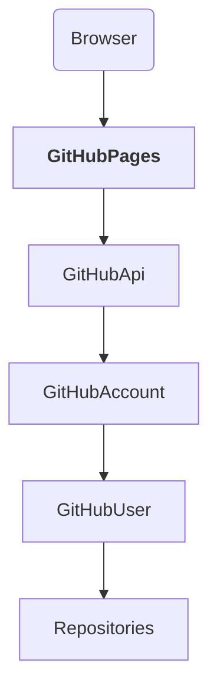
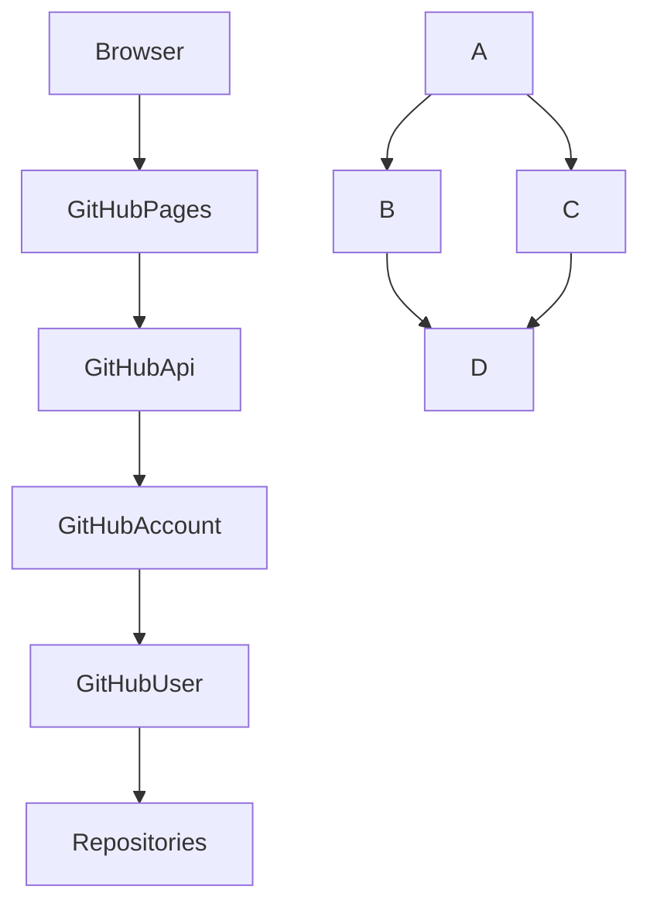
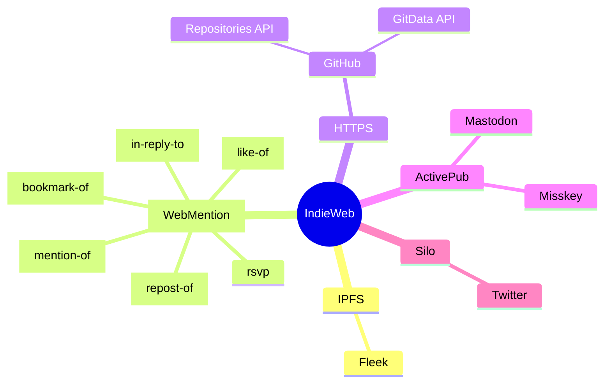
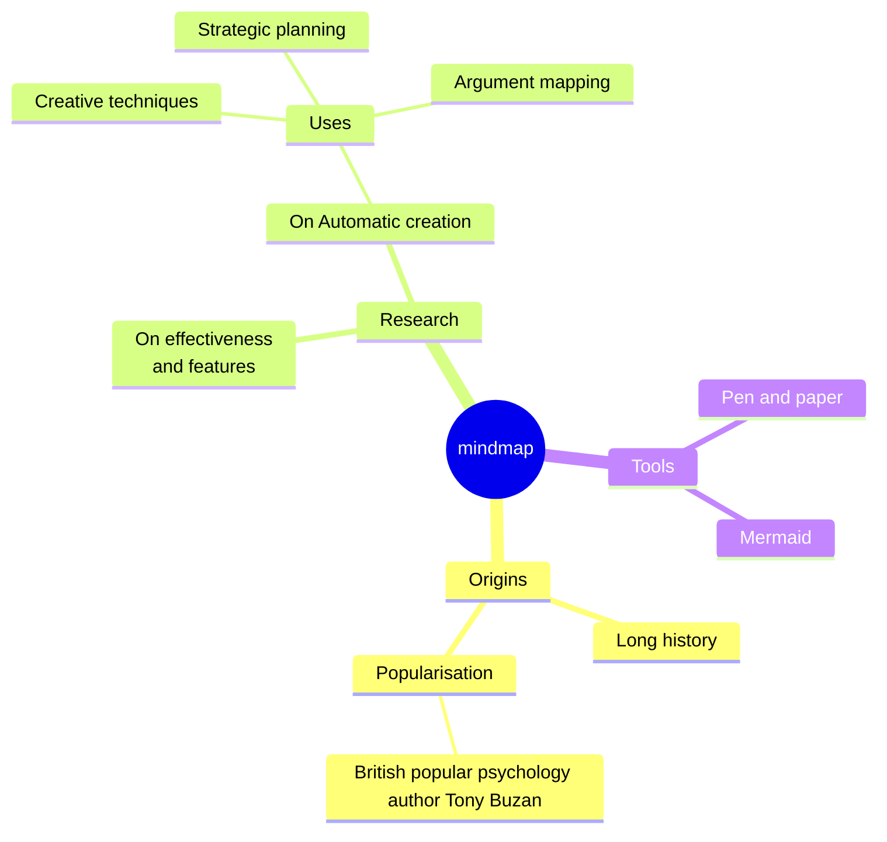
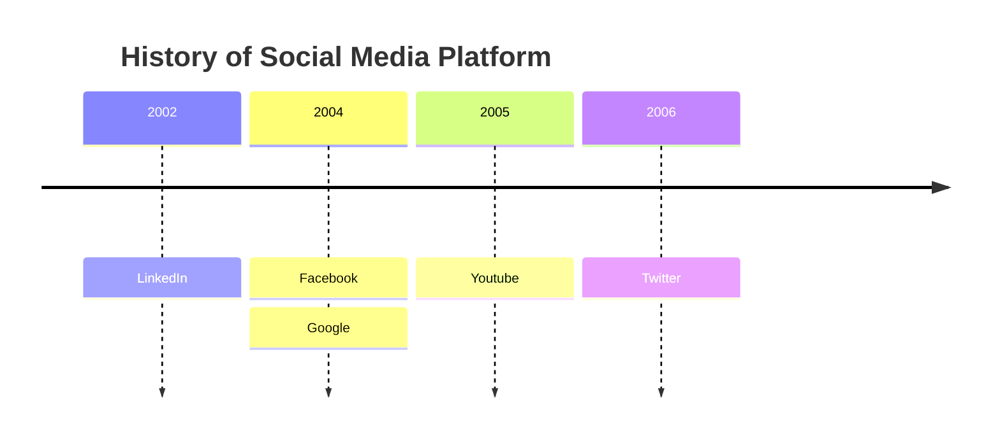

<!---
title: Markdownのパースをテストする
summary: 
description: 
series: 
categories: ['', '']
tags: ['', '']
dates: yyyy-mm-ddT00:00:00, yyyy-mm-ddT00:00:00, yyyy-mm-ddT00:00:00
slug: 
-->

# Markdownのパースをテストする

これは日本語《にほんご》です。

これは｜HTML《はいぱーてきすとまーくあっぷらんげーじ》です。

要素種別|概要
--------|----
`inline`|文章の中に現れる
`block|`inline`や`block-leaf`を含む

要素種別|概要
--------|----
`container-block`|
`leaf-block`|他の文章とは

# メタ文字

## エスケープ

　Markdownに使われるメタ文字自体を使いたいときはメタ文字の前にバックスラッシュ`\`を入れる。

````markdown
```markdown
\*
```
````

\*

# 要素種別

<table>
<tr><th colspan="2">Type</th><th>概要</th><th>例</th></tr>
<tr><td colspan="2">inline</td><td>文章の中に現れる</td><td>code-span,em,strong,img,a-in,a-auto,space-br,text</td></tr>
<tr><td rowspan="2">block</td><td>container</td><td>他のブロックを含める</td><td>blockquote,ul,ol,li</td></tr>
<tr><td>leaf</td><td>他のブロックを含めない</td><td>hr,h1,pre-code,html,a-ref,p,newline</td></tr>
</table>


# 情報源《じょうほうげん》

ライブラリ|概要
----------|----
[marked.js][]|MarkdownをHTMLに変換する

規格|概要
----|----
[CommonMark][]|最小限のMarkdown規格
[GMF][]|[CommonMark][]を拡張した（テーブル、タスクリスト、取り消し線、自動リンク）

[marked.js]:https://marked.js.org/
[CommonMark]:https://spec.commonmark.org/
[GMF]:https://github.github.com/gfm/

# [CommonMark][]

## インライン要素

### br

### double-space

一行目の改行直前にスペースを２つ入れると改行される。

１パラグラフ１行目  
１パラグラフ２行目

２パラグラフ１行目  
２パラグラフ２行目

      

３パラグラフ。上のパラグラフとの間にbrを入れることはできない。

### newline

１パラグラフ１行目
１パラグラフ２行目

２パラグラフ１行目
２パラグラフ２行目


３パラグラフ。上のパラグラフとの間に３つbrがあること。
これを有効にするには`marked.setOptions({breaks:true})`が必要。

### em

\*で囲んだ*ここを強調*する。

### strong

\*\*で囲んだ**ここを強調**する。

### code-span

\`で囲んだ`ここをフラグメント化`する。

<a id="link"></a>
### [a](#link)

<table>
<tr><th colspan="2">Type</th><th>Markdown</th><th>表示結果</th></tr>
<tr><th colspan="2">destination</th>
<td>

```markdown a-i-m-format.md
<URL>
```
---
```markdown a-d-m-example.md
<https://spec.commonmark.org/0.30/#link-destination>
```

</td>
<td>

<https://spec.commonmark.org/0.30/#link-destination>
<https://spec.commonmark.org/0.30/#autolink>

</td>
</tr>

<tr><th colspan="2">inline</th>
<td>

```markdown a-i-format.md
[TEXT](URL)
```
---
```markdown a-i-example.md
[inline](https://spec.commonmark.org/0.30/#inline-link)
```

</td>
<td>

[inline](https://spec.commonmark.org/0.30/#inline-link)

</td>
</tr>

<tr><th rowspan="3">reference</th><th>full</th>
<td>

```markdown a-f-format.md
[TEXT][ID]

[ID]:URL
```
---
```markdown a-f-example.md
[full reference link][FULL]

[FULL]:https://spec.commonmark.org/0.30/#full-reference-link
```

</td>
<td>

[full reference link][FULL]

[FULL]:https://spec.commonmark.org/0.30/#full-reference-link

</td>
</tr>

<tr><th>collapsed</th>
<td>

```markdown a-c-format.md
[ID][]

[ID]:URL
```
---
```markdown a-c-example.md
[collapsed][]

[collapsed]:https://spec.commonmark.org/0.30/#collapsed-reference-link
```

</td>
<td>

[collapsed][]

[collapsed]:https://spec.commonmark.org/0.30/#collapsed-reference-link

</td>
</tr>

<tr><th>shortcut</th>
<td>

```markdown a-s-format.md
[ID]

[ID]:URL
```
---
```markdown a-s-example.md
[shortcut]

[shortcut]:https://spec.commonmark.org/0.30/#shortcut-reference-link
```

</td>
<td>

[shortcut]

[shortcut]:https://spec.commonmark.org/0.30/#shortcut-reference-link

</td>
</tr>
</table>

### img

<table>
<tr><th colspan="2">Type</th><th>Markdown</th><th>表示結果</th></tr>
<tr><th colspan="2">inline</th>
<td>

```markdown a-i-format.md

```
---
```markdown a-i-example.md

```

</td>
<td>


</td>
</tr>

<tr><th rowspan="3">reference</th><th>full</th>
<td>

```markdown a-f-format.md
![alt属性値][ID]

[ID]:URL
```
---
```markdown a-f-example.md
![alt属性値][some-image-0]

[some-image-0]:asset/image/pexels-timo-volz-3643714_1071x1606-min.jpg
```

</td>
<td>

![alt属性値][some-image-0]

[some-image-0]:asset/image/pexels-timo-volz-3643714_1071x1606-min.jpg

</td>
</tr>

<tr><th>collapsed</th>
<td>

```markdown a-c-format.md
![ID][]

[ID]:URL
```
---
```markdown a-c-example.md
![some-image-1][]

[some-image-1]:asset/image/pexels-timo-volz-3643714_1071x1606-min.jpg
```

</td>
<td>

![some-image-1][]

[some-image-1]:asset/image/pexels-timo-volz-3643714_1071x1606-min.jpg

</td>
</tr>

<tr><th>shortcut</th>
<td>

```markdown a-s-format.md
![ID]

[ID]:URL
```
---
```markdown a-s-example.md
![some-image-2]

[some-image-2]:asset/image/pexels-timo-volz-3643714_1071x1606-min.jpg
```

</td>
<td>

![some-image-2]

[some-image-2]:asset/image/pexels-timo-volz-3643714_1071x1606-min.jpg

</td>
</tr>
</table>

### 画像リンク

<table>
<tr><th colspan="2">Type</th><th>Markdown</th><th>表示結果</th></tr>
<tr><th colspan="2">inline</th>
<td>

```markdown a-i-format.md
[](URL)
```
---
```markdown a-i-example.md
[](https://marked.js.org/)
```

</td>
<td>

[](https://marked.js.org/)

</td>
</tr>

<tr><th rowspan="3">reference</th><th>full</th>
<td>

```markdown a-f-format.md
[![alt属性値][画像ID]][ID]

[画像ID]:画像URL
[ID]:URL
```
---
```markdown a-f-example.md
[![alt属性値][some-image-0]][marked.js.org]

[some-image-0]:asset/image/pexels-timo-volz-3643714_1071x1606-min.jpg
[marked.js.org]:https://marked.js.org/
```

</td>
<td>

[![alt属性値][some-image-0]][marked.js.org]

[some-image-0]:asset/image/pexels-timo-volz-3643714_1071x1606-min.jpg
[marked.js.org]:https://marked.js.org/

</td>
</tr>

<tr><th>collapsed</th>
<td>

```markdown a-c-format.md
[![][画像ID]][ID]

[画像ID]:画像URL
[ID]:URL
```
---
```markdown a-c-example.md
[![][some-image-1]][marked.js.org]

[some-image-1]:asset/image/pexels-timo-volz-3643714_1071x1606-min.jpg
[marked.js.org]:https://marked.js.org/
```

</td>
<td>

[![][some-image-1]][marked.js.org]

[some-image-1]:asset/image/pexels-timo-volz-3643714_1071x1606-min.jpg
[marked.js.org]:https://marked.js.org/

</td>
</tr>

<tr><th>shortcut</th>
<td>

```markdown a-s-format.md
[![画像ID]][ID]

[画像ID]:画像URL
[ID]:URL
```
---
```markdown a-s-example.md
[![some-image-2]][marked.js.org]

[some-image-2]:asset/image/pexels-timo-volz-3643714_1071x1606-min.jpg
[marked.js.org]:https://marked.js.org/
```

</td>
<td>

![some-image-2]

[some-image-2]:asset/image/pexels-timo-volz-3643714_1071x1606-min.jpg

</td>
</tr>
</table>

### text


## リーフ・ブロック要素

### hr

```markdown
---
```

---

### h1

```markdown
# h1
## h2
### h3
#### h4
##### h5
###### h6
```

### pre-code

````markdown
```markdown
# hello

* item1
* item2
```
````

```markdown
# hello

* item1
* item2
```

### paragraph

```markdown
aaa
bbb

ccc
ddd
```

### 空行

　無視される。

## コンテナ・ブロック要素

### blockquote

```markdown
> # 引用元の見出し
> 引用元パラグラフ１
> 引用元パラグラフ１
> 
> 引用元パラグラフ２
```

> # 引用元の見出し
> 引用元パラグラフ１
> 引用元パラグラフ１
> 
> 引用元パラグラフ２

　パラグラフ１行目の末尾にスペースを２つ入れると改行される。

```markdown
> # 引用元の見出し
> 引用元パラグラフ１の１行目  
> 引用元パラグラフ１の２行目
> 
> 引用元パラグラフ２
```

> # 引用元の見出し
> 引用元パラグラフ１の１行目  
> 引用元パラグラフ１の２行目
> 
> 引用元パラグラフ２

　引用元へのリンクを付与する。

```markdown
> # 引用元の見出し
> 引用元パラグラフ１の１行目  
> 引用元パラグラフ１の２行目
> 
> 引用元パラグラフ２
>
> <cite>[marked.js.org](https://marked.js.org/)</cite>
```

> # 引用元の見出し
> 引用元パラグラフ１の１行目  
> 引用元パラグラフ１の２行目
> 
> 引用元パラグラフ２
>
> <cite>[marked.js.org](https://marked.js.org/)</cite>

### pre-code

````markdown
```
何か書く
```
````

````markdown
```markdown
# 何か書く
```
````

　ネストさせたいときは親のバッククォート`` ` ``を増やす。

`````markdown
````markdown
```markdown
# 何か書く
```
````
`````

　ネストの使い所はマークダウン・パーサで本文を書いているとき、マークダウン構文のソースコードを表示したい場合。この文書はまさにこのネストを使っている。元となるマークダウン文書はHTMLで表示されている内容よりひとつ多くpre-codeフェンシングがネストしている。

## リスト

### 順序なし `<ul>`

```markdown
- item1
- item2
```

- item1
- item2


```markdown
+ item3
+ item4
```

+ item3
+ item4

```markdown
* item5
* item6
```

* item5
* item6


### 順序つき `<ol>`

```markdown
1. one
2. two
3. tree
```

1. one
2. two
3. tree

　番号は数値であれば何でもいい。順次インクリメントされる。

```markdown
1. one
1. two
1. tree
```

1. one
1. two
1. tree

　開始する番号を指定できる。

```markdown
0. zero
0. one
0. two
```

0. zero
0. one
0. two

```markdown
7. seven
7. eight
7. nine
```

7. seven
7. eight
7. nine

　ネストできる。

```markdown
1. 1
    1. 1-1
        1. 1-1-1
            1. 1-1-1-1
                1. 1-1-1-1-1
                    1. 1-1-1-1-1-1
                    1. 1-1-1-1-1-2
                1. 1-1-1-1-2
            1. 1-1-1-2
        1. 1-1-2
    1. 1-2
1. 2
```

1. 1
    1. 1-1
        1. 1-1-1
            1. 1-1-1-1
                1. 1-1-1-1-1
                    1. 1-1-1-1-1-1
                    1. 1-1-1-1-1-2
                1. 1-1-1-1-2
            1. 1-1-1-2
        1. 1-1-2
    1. 1-2
1. 2


# [GMF][]

## Table

```markdown
| foo | bar |
| --- | --- |
| baz | bim |
```

| foo | bar |
| --- | --- |
| baz | bim |

```markdown
foo|bar
---|---
baz|bim
```

foo|bar
---|---
baz|bim


## Task list items

　チェックボックス付きのリストを作る。

```markdown
- [ ] foo
- [x] bar
```

- [ ] foo
- [x] bar

　ネストもできる。

```markdown
- [x] foo
  - [ ] bar
  - [x] baz
- [ ] bim
```

- [x] foo
  - [ ] bar
  - [x] baz
- [ ] bim

## Strikethrough

```markdown
~~Hi~~ Hello, ~there~ world!
```

~~Hi~~ Hello, ~there~ world!

## Autolinks

```markdown
http://www.commonmark.org
```

http://www.commonmark.org

# 欲しいのに無い機能

## cite

* blockquoteの最後がaであればciteで囲んで欲しい
* blockquoteの最後が任意テキストのときciteで囲みたいときもある（有名人の名言を引用したとき等）

## ruby

* 青空文庫みたいにしたい

## em

* 青空文庫みたいにしたい

## kbd, var, samp

```html
<kbd>Ctrl</kbd>+<kbd>V</kbd>
```

```html
<var>変数名</var>
```

```html
<samp>プログラムからの出力値例</samp>
```

* 端末の表示（シェルの入出力、PythonのREPLなど）

## ol, li

* [list-style-type](https://developer.mozilla.org/ja/docs/Web/CSS/list-style-type)で字種を指定したい

<details><summary>丸囲み文字</summary>

```
０、１、２、３、
⓪、①、②、③…㊿
　　❶、❷、❸…⓴
〇、一、二、三…十
零、壱、弐、参…
　　あ、い、う…ん
　　ア、イ、ウ…ン
　　ａ、ｂ、ｃ…ｚ
　　Ａ、Ｂ、Ｃ…Ｚ
　　Ⓐ、Ⓑ、Ⓒ…Ⓩ
　　🅐、🅑、🅒…🅩
　　ⓐ、ⓑ、ⓒ…ⓩ
　　㊀、㊁、㊂…㊉
　　㋐、㋑、㋒…㋾

Ⓐ	Ⓑ	Ⓒ	Ⓓ	Ⓔ
Ⓕ	Ⓖ	Ⓗ	Ⓘ	Ⓙ
Ⓚ	Ⓛ	Ⓜ	Ⓝ	Ⓞ
Ⓟ	Ⓠ	Ⓡ	Ⓢ	Ⓣ
Ⓤ	Ⓥ	Ⓦ	Ⓧ	Ⓨ
Ⓩ
🅐	🅑	🅒	🅓	🅔
🅕	🅖	🅗	🅘	🅙
🅚	🅛	🅜	🅝	🅞
🅟	🅠	🅡	🅢	🅣
🅤	🅥	🅦	🅧	🅨
🅩
ⓐ	ⓑ	ⓒ	ⓓ	ⓔ
ⓕ	ⓖ	ⓗ	ⓘ	ⓙ
ⓚ	ⓛ	ⓜ	ⓝ	ⓞ
ⓟ	ⓠ	ⓡ	ⓢ	ⓣ
ⓤ	ⓥ	ⓦ	ⓧ	ⓨ
ⓩ
❶	❷	❸	❹	❺
❻	❼	❽	❾	❿
⓫	⓬	⓭	⓮	⓯
⓰	⓱	⓲	⓳	⓴
⓪
①	②	③	④	⑤
⑥	⑦	⑧	⑨	⑩
⑪	⑫	⑬	⑭	⑮
⑯	⑰	⑱	⑲	⑳
㉑	㉒	㉓	㉔	㉕
㉖	㉗	㉘	㉙	㉚
㉛	㉜	㉝	㉞	㉟
㊱	㊲	㊳	㊴	㊵
㊶	㊷	㊸	㊹	㊺
㊻	㊼	㊽	㊾	㊿
⓵	⓶	⓷	⓸	⓹
⓺	⓻	⓼	⓽	⓾
㊀	㊁	㊂	㊃	㊄
㊅	㊆	㊇	㊈	㊉
㋐	㋑	㋒	㋓	㋔
㋕	㋖	㋗	㋘	㋙
㋚	㋛	㋜	㋝	㋞
㋟	㋠	㋡	㋢	㋣
㋤	㋥	㋦	㋧	㋨
㋩	㋪	㋫	㋬	㋭
㋮	㋯	㋰	㋱	㋲
㋳	㋴	㋵
㋶	㋷	㋸	㋹	㋺
㋻	㋼	㋽	㋾
㊊	㊋	㊌	㊍	㊎
㊏	㊐
㉄	㉆	㊑	㊒	㊓
㊔	㊕	㊖	㊗	㊘
㊙	㊚	㊛	㊜	㊝
㊞	㊟	㊠	㊡	㊢
㊣	㊤	㊥	㊦	㊧
㊨	㊩	㊪	㊫	㊬
㊭	㊮	㊯	㊰	🉐
🉑
©	®	⊕	⊖	⊗
⊘	⊙	⊚	⊛	⊜
⊝	⌾	⍟	⎉	⎊
◉	○	◍	◎	●
◐	◑	◒	◓	◔
◕	◦	☉	☮	☯
☹	☺	☻	♼	♽
⛒	⛔	✆	✇	✪
❂	⦶	⦷	⦸	⦹
⦺	⦼	⦾	⦿	⧀
⧁	⨀	⨁	⨂	⨷
⨸	⭖	⭗	⭙	⮈
⮉	⮊	⮋	⮾	⮿
〶	📵	🔘	🔞	🕀
🕲	🚫	🚭	🚯	🚱
🚳	🚷	🛇	🛈
```

</details>

## code

* 構文強調（highlight.js）
* コピーボタン
* ファイル名表示
* 行数表示
* 開始行数指定
* 指定行ハイライト
* 指定行グレーアウト
* marmaid, markmap, plantUMLでテキスト解析してSVGにする
* コード実行（入力したコードをリアルタイムで解析し実行し結果表示する）

## img

* attr
    * `loading=eager,lazy`
    * `srcset`
    * `sizes`
* css
    * `width: `
    * `height: `
    * `object-fit: cover;`

## table

* セル結合
    * `colspan`
    * `rowspan`
* `<th>`
    * なし
    * 縦
    * 縦横
    * 複数行列
* `text-align`
    * `start`
    * `end`
    * `center`
    * `justify`
* `<td>`に`<ul>`や`<pre><code>`など複数行のマークダウン内容を入れる

## form, button, input, select, textarea, meter, datalist, fieldset, legend, label, output

　テキストで楽に書けたら嬉しい。

<details><summary>こんな感じに？</summary>

````markdown
```form submit method=POST action=URL
[     ] type=text
[●   ] type=password
[🔗🌏 ] type=url
[■   ] type=color
[📅ymd] type=date
[ymdhm] type=datetime-local
[ym   ] type=month
[⏰hm ] type=time
[week ] type=week
[@✉   ] type=email
[FILE ] type=file
[     ] type=hidden
[     ] type=image
[     ] type=number
[     ] type=range ---o---
[     ] type=reset
[🔍🔎 ] type=serch
[     ] type=submit
[     ] type=tel

[textbox] type=password
[textbox] datalist
{select } optionValue, optionValue, ...
(       ) meter
<button>  button type=submit,reset,button

---
textarea

---

checkbox
[ ]
[x]
radio
( )
(o)
( ) name, value1, value2, (checkedValue)

fieldset, legend, label, output
```
````

```html
<label><input id="" name="" type="" value=""></label>

<label><input type="checkbox, radio"><span>ラベル名</span></label>
<label><span>ラベル名</span><input type="text,password,email,url,tel..."></input></label>
<label><input type="search,hidden,file"></input></label>
```

* id,name
    * 重複チェック
    * 有効文字チェック
* label
    * 位置
    * 言語（英語、日本語）
* option
* datalist
* validation
    * requied
    * maxlength
    * ...
* fieldset
    * legend
    * 内包要素

　問題もある。

* レイアウトの定義は難しそう。flex, gridなど。
* 標準UIが使いづらい
    * checkbox,radio
        * フォントサイズと同じにならず小さすぎる
        * checkedなlabelの色を変えるCSSセレクタがない(:has()はあるが新しいブラウザしか使えない)
    * input=number
        * スマホだと小さすぎて上下ボタンが押せない
    * input=range
        * 目盛りをクリックして値をセットできない
* Vue.jsなどでUIを作るのがデファクトスタンダードになりつつある（WebComponent）

</details>

# diaglam

## mermaid








<!--

    W[WebMention]
    W[<a href="https://github.com/aaronpk/webmention.io#api">WebMention<a>]

  click W "https://github.com/aaronpk/webmention.io#api"

    I[IPFS]
  click I https://ipfs-book.decentralized-web.jp/what_is_ipfs/
-->






## markmap

<style> 
.markmap > svg {
width: 100%; 
height: 300px;
}
</style>

<!--
-->
<!--
<div class="markmap">
# markmap
## べんり
## きれい
## はやい
</div>
-->

```markmap
# markmap
## べんり
## きれい
## はやい
* スゲー
```

<!--
<script src="https://cdn.jsdelivr.net/npm/markmap-autoloader"></script>
<div class="markmap">
# markmap
## べんり
## きれい
## はやい
</div>
-->

```markmap
# [IndieWeb](https://www.cotan-en.com/blogs/news/the-indieweb-movement)
## [IPFS](https://ipfs-book.decentralized-web.jp/what_is_ipfs/)
### [Fleek](https://fleek.co/)
## HTTPS
### [WebMention](https://webmention.io/)
#### in-reply-to
#### like-of
#### repost-of
#### bookmark-of
#### mention-of
#### rsvp
### [ActivePub](https://ja.wikipedia.org/wiki/ActivityPub)
#### Mastodon
#### Misskey
### Silo
#### [GitHub](https://github.co.jp/)
##### [Repositories API](https://docs.github.com/ja/rest/repos)
##### [GitData API](https://int128.hatenablog.com/entry/2017/09/05/161641)
##### [octokit.js](https://github.com/octokit/octokit.js/)
#### Twitter
#### FaceBook
#### YouTube
#### Hatena
```

